# Part 1

- Pantallazo del application.properties modificado
    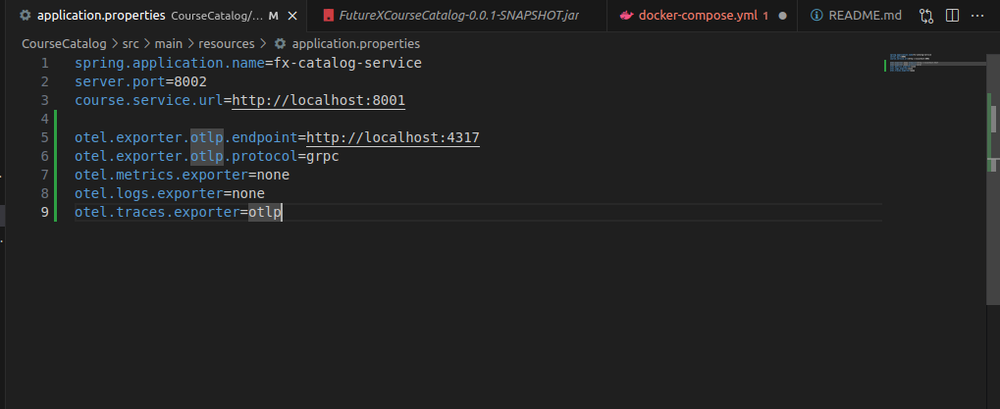

- Pantallazo de la aplicación ejecutándose con el agente
    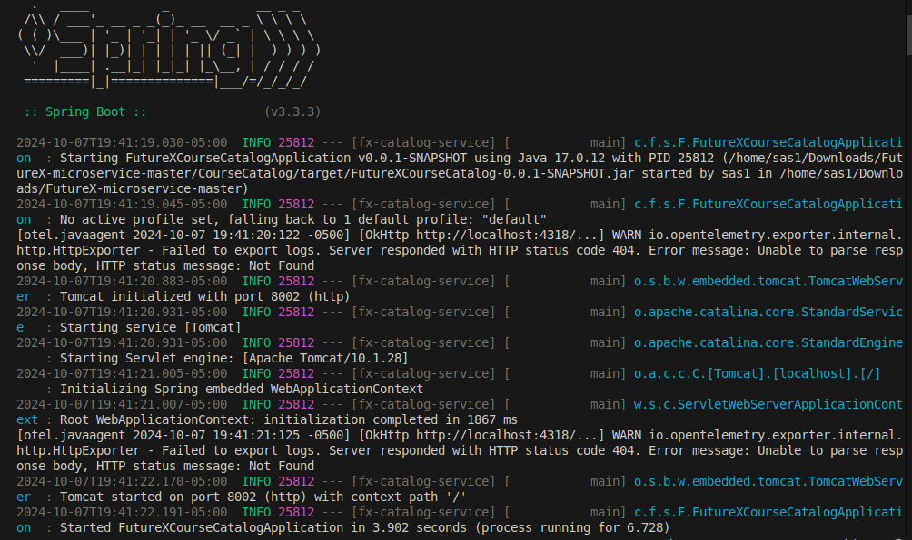

- Pantallazo de las trazas en la UI de Jaeger
    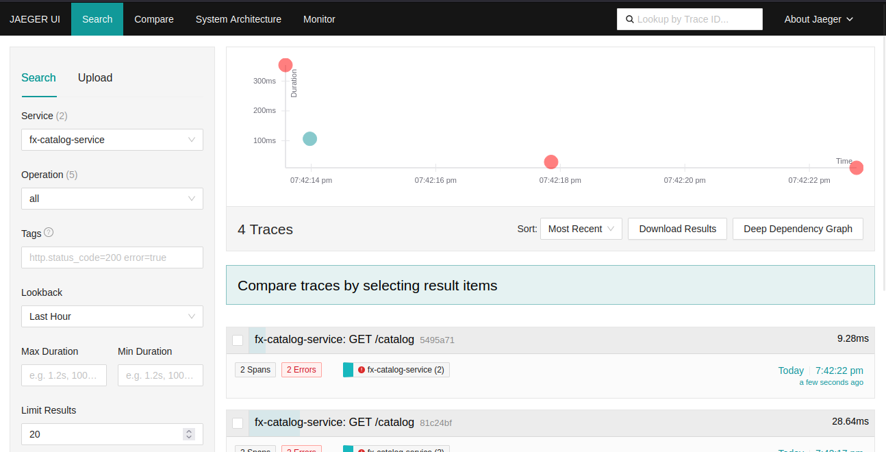
    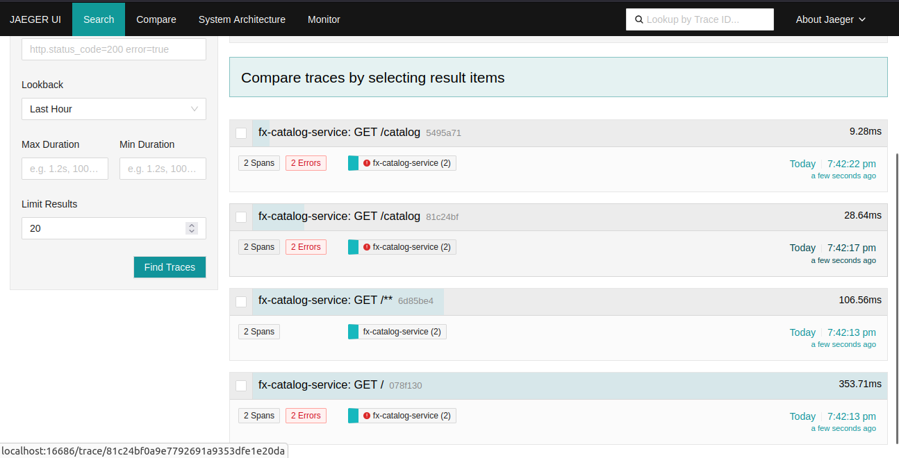

# Part 2

- Pantallazo de la clase OpenTelemetryConfig
    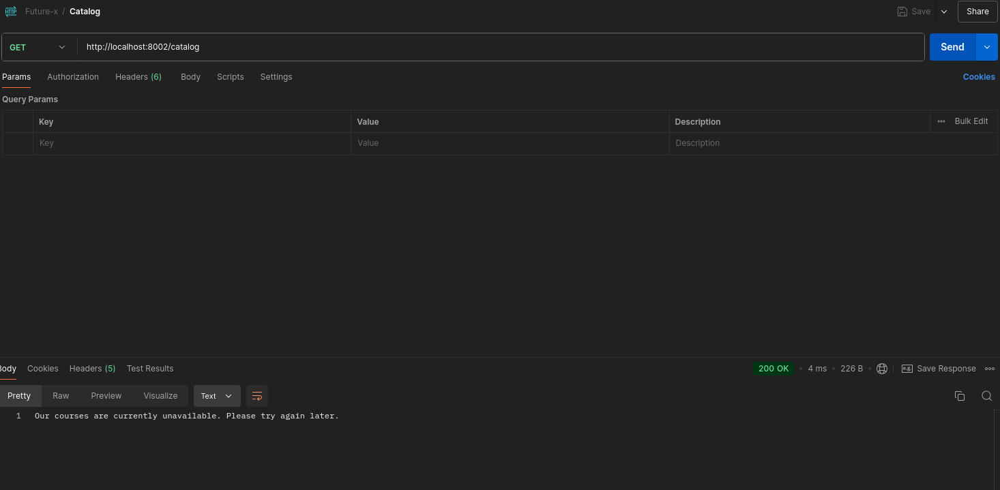

- Pantallazo de los controladores modificados
    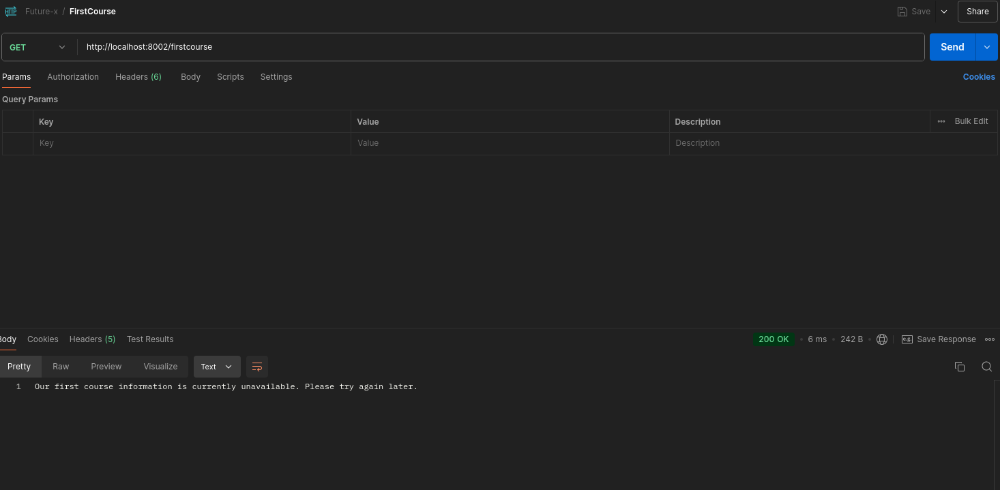
    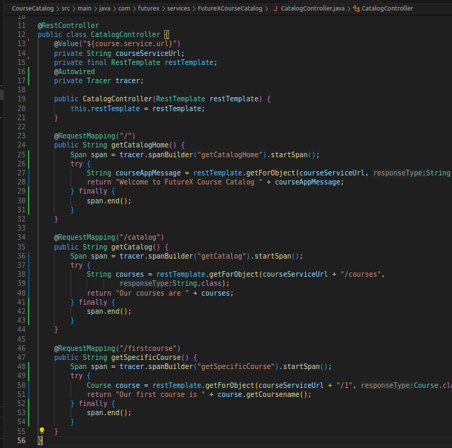

- Pantallazo de las trazas en Jaeger
    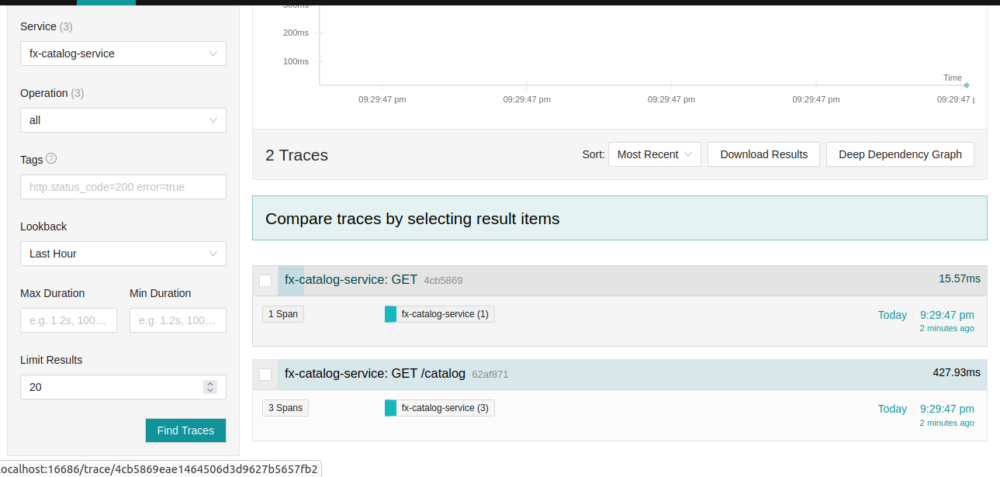
    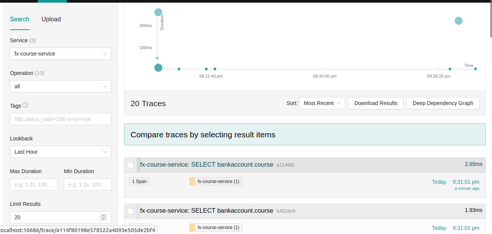

# Part 3

- Pantallazo del archivo de configuración del Colector (yaml)
    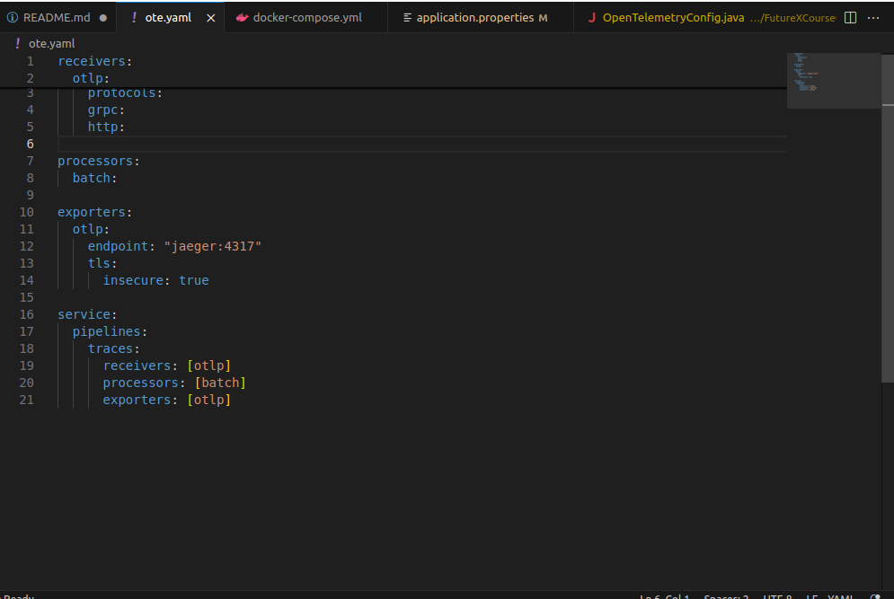

- Pantallazo del application.properties modificado
    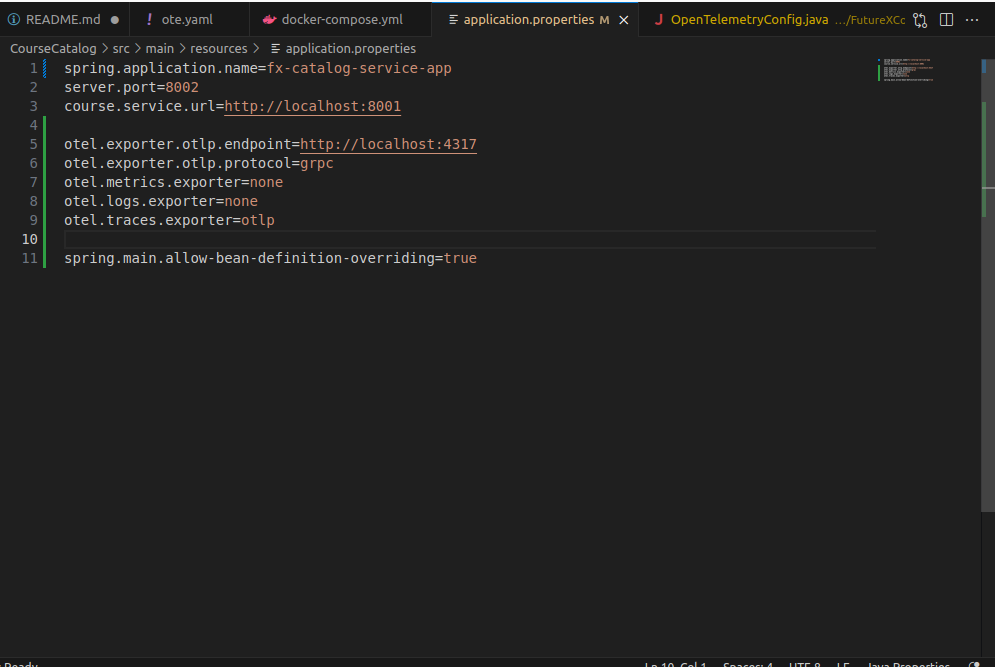

- Pantallazo de la clase OpenTelemetryConfig actualizada
    

- Pantallazo de las trazas en Jaeger pasando por el Colector
    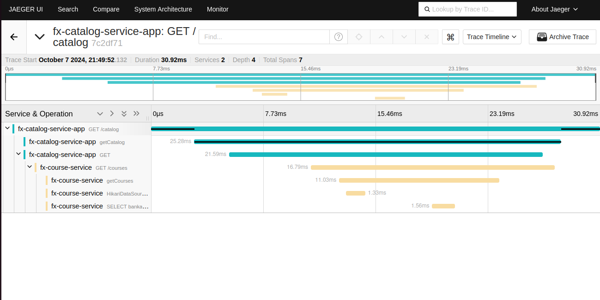